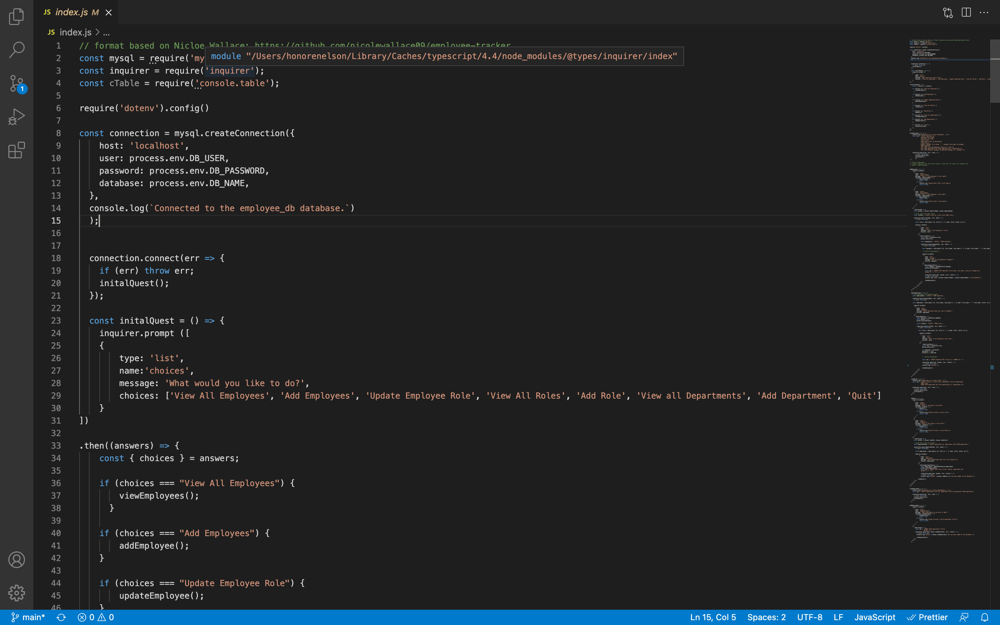
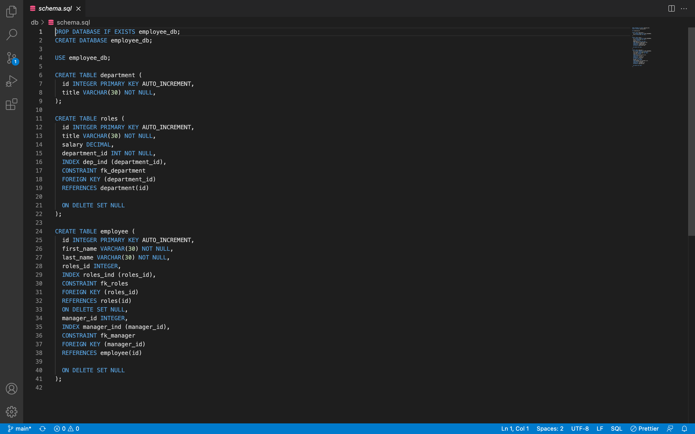

# Employee Tracker 
[](https://opensource.org/licenses/MIT)
#### **Name:** Honore Nelson
#### **Deployed Link:** backend application- no url
#### **Github Repo:** https://github.com/matisses-goldfish/Employee-Tracker
---
    
##  Table of Contents:
* [Description](#description)
* [Walkthrough](#walkthrough)
* [Application](#application)
* [Reference](#reference)
* [Installation](#installation)
* [Usage Information](#usage)
* [Technologies Used](#technologies-used)
* [Authors](#authors)
* [License](#license)
* [Question](#questions)


## Description:
---
This application allows a user to create and view their employees, roles, and salaries, through this command line application.

## Walkthrough:
---
### Click on the img to begin the demo video!
[](https://www.youtube.com/embed/9xZHtHGv_tU)

## Application:
---



## Reference:
---
```md
GIVEN a command-line application that accepts user input
WHEN I start the application
THEN I am presented with the following options: view all departments, view all roles, view all employees, add a department, add a role, add an employee, and update an employee role
WHEN I choose to view all departments
THEN I am presented with a formatted table showing department names and department ids
WHEN I choose to view all roles
THEN I am presented with the job title, role id, the department that role belongs to, and the salary for that role
WHEN I choose to view all employees
THEN I am presented with a formatted table showing employee data, including employee ids, first names, last names, job titles, departments, salaries, and managers that the employees report to
WHEN I choose to add a department
THEN I am prompted to enter the name of the department and that department is added to the database
WHEN I choose to add a role
THEN I am prompted to enter the name, salary, and department for the role and that role is added to the database
WHEN I choose to add an employee
THEN I am prompted to enter the employee’s first name, last name, role, and manager, and that employee is added to the database
WHEN I choose to update an employee role
THEN I am prompted to select an employee to update and their new role and this information is updated in the database 
```

## Installation:
---
    node index.js

## Usage
---
#### Begin by installing the given packages by typing:
    npm i 
#### in your integrated terminal, then type:
    node server.js 
#### to begin the application
    
## Technologies Used:
---
* dotenv
* inuirer
* mysql


## Contribution Guidelines
---
Contribute using the github workflow model
    
## Sources
---
#### Code formated after (source in code as well):
* Nicole Wallace https://github.com/nicolewallace09/employee-tracker
    
## Authors
---
* **Honore Nelson** - *Initial work* - [Employee Tracker](https://github.com/matisses-goldfish/Employee-Tracker)
    
## License
---
MIT
This project is licensed under the MIT License - see the [LICENSE.md](LICENSE.md) file for details
<br></br>

## Question
---
Any additional question? 
### Contact me at:
* Gmail: honoregn@gmail.com
* Github: matisses-goldfish
